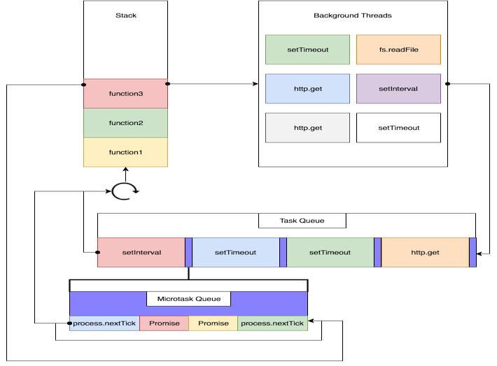

# Event Queue

Javascript is a single thread languange;

We can't put thread into `sleep` mode and block thread;

Event queue is the corner stone;

https://blog.risingstack.com/node-js-at-scale-understanding-node-js-event-loop/

---

# Event Queue -- diagram



---

# Callback

```javascript
function serverCall(onSuccess) {
    //making asynchronise call, ajax/timeout/etc.
    $.ajax('some-url', some-data, {
        success: onSuccess
    })
}
```

--

Hell !!😱😱😱
```javascript
function main() {
    createOrder(function(orderId){
        addProductsToOrder(orderId, products, function(transactionNumber){
            sendConfirmationEmail(transactionNumber, function(){
                andOthers(function() {
                    andOthers2(function(){
                        andOther3(function(){})
                    })
                })
            })
        })
    })
}
```

---

# Callback (better?) Hell 😅

```javascript
function main() {
    createOrder(addProductsToOrder)
}
function addProductsToOrder(orderId) {
    serverCall_AddProducts(orderId, products, sendConfirmation, addProductFail)
}
function addProductFail() {
    //blahblah
}
function sendConfirmation(transactionNumber) {
    serverCall_SendConfirmation(andOthers, sendConfirmFail);
}
function sendConfirmFail() {
    //blah blah
}
```

Cons:

* code flow is broken into sub-functions, very hard to understand
* handling failure is also hard

---

# `Promise` to the resuce

```javascript
function main() {
    const initialPromise = createOrder();
    const anotherPromise = initialPromise
        .then(addProductsToOrder);
        .catch(onFailAddProduct)
        .then(function(transactionNumber){
            return sendConfirmationEmail(transactionNumber);
        });
        .catch(onFailSendConfirm)
    anotherPromise
        .then(andOthers)
        .then(andOthers2)
        .catch(onGenericFailure);
}
```

Pros:
* Easy to understand code workflow
* Easy to handle error

Cons:
* Sometimes you need to wrap your head around the `then`, `catch`
* watch the return value in `then` and `catch`, the result can be completetly different

---

# Generator to the rescure

```javascript
function* anotherGenerator(i) {
  yield i + 1;
  yield i + 2;
  yield i + 3;
}

function* generator(i) {
  yield i;
  yield* anotherGenerator(i);
  yield i + 10;
}

var gen = generator(10);

console.log(gen.next().value); // 10
console.log(gen.next().value); // 11
console.log(gen.next().value); // 12
console.log(gen.next().value); // 13
console.log(gen.next().value); // 20
```

--

## 🤔 But, how do we make code better with generator?

---

# Coroutines rock(ed)!

```javascript
coroutine(function* () {
    try {
        let orderId = yield createOrder();
        let transactonNumber = yield addProductsToOrder(orderId, products);
        yield sendConfirmationEmail(transactionNumber);
    } catch (e) {
        yield orderError(e);
    }
    yield others();
    yield others2();
});
```

It (almost) has everything we need. It works with `Promise` (via most of the library);

The only drawback is we need libs (`co`, `koroutine`)

---

# `Finally`, `Async` / `Await`

## Remeber, `async` `await` are all about `Promise`

```javascript
async function main() { //This main() will return a Promise
    try {
        let orderId = await createOrder(); //await extract the Promise
        let transactonNumber = await addProductsToOrder(orderId, products);
        await sendConfirmationEmail(transactionNumber);
    } catch (e) {
        await orderError(e);
    }
    await others();
    await others2();
}
function createOrder() {
    //return a Promise with value in it
    return new Promise((resolve,reject)=>{resolve(orderId)});
}
async function addProductsToOrder() {
    //this is async funciton, the returned value will be wrapped in a Promise
    return transactionNumber;
}
```

---

# Transpile

Not all browser support async/await natively, we need to transpile it

The defacto is to use `babel`

```javascript
async function hello(name) {
    return 'hello ' + name;
}
async function greeting() {
   var msg = await hello('team'); 
   console.log(msg);
}
function main() {
    greeting();
}
```

will be transpiled to...

---

```javascript
var greeting = function () {
    var _ref2 = _asyncToGenerator( /*#__PURE__*/regeneratorRuntime.mark(function _callee2() {
        var msg;
        return regeneratorRuntime.wrap(function _callee2$(_context2) {
            while (1) {
                switch (_context2.prev = _context2.next) {
                    case 0:
                        _context2.next = 2;
                        return hello('team');

                    case 2:
                        msg = _context2.sent;

                        console.log(msg);

                    case 4:
                    case 'end':
                        return _context2.stop();
                }
            }
        }, _callee2, this);
    }));

    return function greeting() {
        return _ref2.apply(this, arguments);
    };
}();

function _asyncToGenerator(fn) { return function () { var gen = fn.apply(this, arguments); return new Promise(function (resolve, reject) { function step(key, arg) { try { var info = gen[key](arg); var value = info.value; } catch (error) { reject(error); return; } if (info.done) { resolve(value); } else { return Promise.resolve(value).then(function (value) { step("next", value); }, function (err) { step("throw", err); }); } } return step("next"); }); }; }

function main() {
    greeting();
}
```

---

# Can I use ? 


--

I 😡 IE

---

# Wrap-up

* JS is single thread

* Asynchronise operation are queue

* Promise, async/await are your friends

