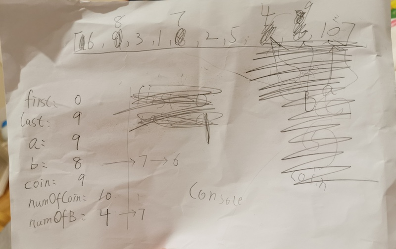

Today I teach Zac how to do a quick sort, with toys and code.

Zac, 6yo, has show interest in learning programming. And of course I'd love to teach him.

At the begining, we do some sorting (`bubble sort`) using poker cards.

It was fun, but it wasn't how the computer works. Everytime Zac picked up a card, he puts it straightly into the right position. It is obvious (as there're only 10 poker cards), and he couldn't understand when I told him computer can't the card into that position straight away. 

Instead, I took small step, mimic the computer, pickup a card, compare, and swap one by one every time, then move on to the next `for` loop.

Now he seems get that, which is cool, I move on the `merge sort`. Suprisingly, `merge sort` is so much easier to explain than `bubble sort`. I just told him, `divide` and cards into two piles, (pretend to) give them two your two brothers (this is tricky as he has only one brother). Now close your eyes and imaging they have sorted each pile for you, all you need to do now is pick one from each of the pile and put (`merge`) them together. 

We did some `tower of hanoi` together before, so the `recursion` concept is a bit familiar and he get that.

Awesome, with that in mind, I gave him some `quick sort`, which went okay, but he a bit tired by then.

The other night, I decided it is time to do some coding. Since only thing he knows is just some `var` and `for`, I do most of the typing. 

We hardcoded the number arrays, and grabbed a paper, mimic some runs on it using pencils (and fingers/pointers, haha)

It works quite well. I've to admin that paper and pencil (fingers) are still the best tool we have in terms of education.

At the end, we did the [code](https://zac.garyxue.me/Javascript/sort.js) together. Hooray, another night of coding!

